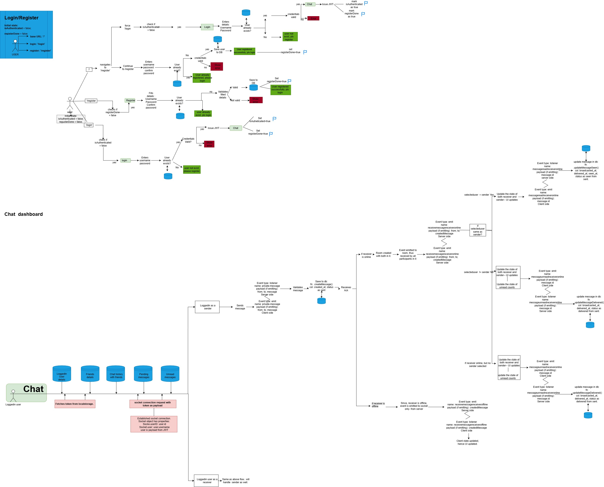

# realtime-chat-system
A full-stack real-time messaging application built using React, Node.js, Express.js, WebSocket(socket.io), and MySQL
## Overview
- Real-time one-to-one chat application - Registering, Login and Chat portal implementation. 
- Authentication handled via JWT + token in local storage.
- Authentication of socket connection 
- Authentication of http request for protected route. 
- Registration, Login edge cases are managed through react state, http requests for registering and login new users and existing users resp.
- Chat portal is implemented through combination of tech stacks: http requests, Socket.io, Mysql (dbms), Express.js, React.js, CSS
- Socket.io library used for server side socket implement and Socket.io-client used for client side socket implementation. 

## Salient Features 
- Realtime messaging using socket.io : Both sender & receiver are online + both sender and receiver are actively chatting with each other.
- Unread messages: Both sender & receiver are online + receiver is chatting with third person, so just put the unread badge with the count of messages unread. (DB query + http request + socket used)
- Pending messages (where receiver is offline, but received message)  (DB query + http request used)
- Clean socket connections: handled duplicate socket connections (1 socket connection per user) via establishing initial socket connection through useEffect hook with correct dependencies. 
- Message lifecycle management: Sent => Delivered => Seen
- JWT based authentication of socket connection and http request to protected routes. 
 

## Techstack
- Frontend: React.js 
- Backend: Node.js , Express.js
- Realtime using WebSockets: Socket.io
- DBMS: Mysql

## Architecture

## Database Schema
- Tables: Users, Messages 
- Users: Contains all the registered users
- Messages: Contains the chats of registered users.

### Columns 
#### Users table: 
Id (PK), Username (UNIQUE), Password (6 characters long), Created_at (DATETIME)

#### Messages: 
- Id (PK)
- sender_id (FK referencing id of users table) 
- receiver_id (FK referencing id of users table)
- created_at (DATETIME) - NOT NULL
- broadcasted_at (DATETIME) - NULL - to track pending messages
- delivered_at (DATETIME) - NULL 
- seen_at (DATETIME) - NULL - to track unread messages
- status (Enum: sent, delivered, seen) - NULL

### Constraints: 
#### Users table: 
- Username must be unique.
- Password must be atleast 6 characters long.

#### Messages table
- Sender_id is foreign key
- Receiver_id is foreign key
- Status must be: sent/delivered/seen

## Setup
### Prerequisites
- Node.js 
- Express.js
- MySQL DBMS

#### Clone the repository
git clone https://github.com/username/repo-name.git
cd repo-name

#### Backend Setup
- cd backend
- npm install

#### Environment variables
- Create a `.env` file in the `Backend` directory using the `.env.example` template, below command to run to create .env using .env.example as a template: 
- cp .env.example .env
- Start backend server
- npm start

#### Frontend setup
- cd ../frontend
- npm install

- Run npm run dev to start dev server 

- Finally accessing application
- Frontend: http://localhost:5173
- Backend API: http://localhost:5000

### To run both frontend and backend together (for convenience)
- From the root directory:
- npm install
- npm start

## Future Improvements
- Group chats 
- Typing indicators
- Online status of friends in realtime 
- Allowing users to add friends to chat (first, they have to register themselves)
- Lazy loading chats in UI(as we are not showing entire chat history)
- Focusing on the last chat– as user opens a  chat.
- Security ( if user is already loggedin, limiting this to only single tab)

### NOTE
- Database is configured for local development.
- Backend is deployment-ready and uses environment-based configuration for production databases.